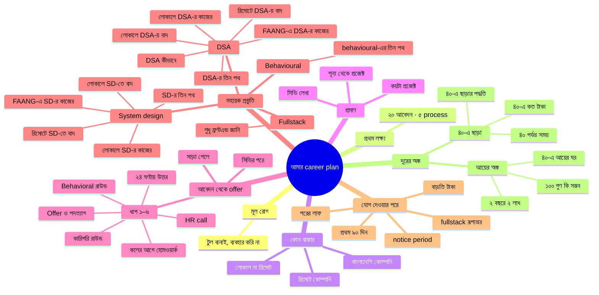

# Thought Map — আমার career plan

*শেষ স্ক্যান: **২০২৬-০৯-১৬** · **১১টা ফাইল, ৪০টা সেকশন** · নিয়ম → [AGENTS.md](AGENTS.md)*

সব ফাইল মিলে একটাই পরিকল্পনা। প্রতিটা ফাইল একটা বিষয়, ভেতরের প্রতিটা `##` সেকশন একটা প্রশ্নের উত্তর। মানচিত্রটা দেখায় কোন সেকশন কোন ধারণার অংশ; নিচের টেবিলগুলো দেখায় কোনটা কোনটার সাথে যুক্ত, আর কোথায় কী অমিল ছিল।

---

## Mindmap

---

## ফাইল-তালিকা

ফাইলের ক্রম = career plan-এর ক্রম। `##` = ফাইলে কয়টা সেকশন; সেকশনের লেবেল ফাইলের ভেতরের ক্রমে।

| ফাইল | শাখা | `##` | সেকশন |
|---|---|---|---|
| [root-problem-and-first-goal.md](root-problem-and-first-goal.md) | মূল রোগ · প্রথম লক্ষ্য | ২ | টুল বানাই, ব্যবহার করি না · ২০ আবেদন · ৫ process |
| [which-market.md](which-market.md) | কোন বাজার | ৩ | লোকাল না রিমোট · বাংলাদেশি কোম্পানি · রিমোট কোম্পানি |
| [proof-projects-and-cv.md](proof-projects-and-cv.md) | প্রমাণ | ৩ | কয়টা প্রজেক্ট · শূন্য থেকে প্রজেক্ট · সিভি লেখা |
| [application-to-offer.md](application-to-offer.md) | আবেদন থেকে offer | ৮ | সিভির পরে · সাড়া পেলে · ২৪ ঘণ্টায় উত্তর · কলের আগে হোমওয়ার্ক · HR call · কারিগরি রাউন্ড · Behavioral রাউন্ড · Offer ও পদত্যাগ |
| [dsa.md](dsa.md) | সহায়ক প্রস্তুতি › DSA | ৬ | DSA কীভাবে · DSA-র তিন পথ · লোকালে DSA-র কাজের · FAANG-এ DSA-র কাজের · লোকালে DSA-য় বাদ · রিমোটে DSA-য় বাদ |
| [system-design.md](system-design.md) | সহায়ক প্রস্তুতি › System design | ৫ | SD-র তিন পথ · লোকালে SD-র কাজের · FAANG-এ SD-র কাজের · লোকালে SD-তে বাদ · রিমোটে SD-তে বাদ |
| [behavioural.md](behavioural.md) | সহায়ক প্রস্তুতি › Behavioural | ১ | behavioural-এর তিন পথ |
| [fullstack.md](fullstack.md) | সহায়ক প্রস্তুতি › Fullstack | ১ | শুধু ফ্রন্টএন্ড জানি |
| [after-joining.md](after-joining.md) | যোগ দেওয়ার পরে | ৫ | notice period · প্রথম ৯০ দিন · বাড়তি টাকা · fullstack রূপান্তর · পরের লাফ |
| [income-math.md](income-math.md) | দূরের অঙ্ক › আয়ের অঙ্ক | ৩ | ২ বছরে ২ লাখ · ১০০ গুণ কি সম্ভব · ৪০-এ আয়ের ঘর |
| [quit-at-40.md](quit-at-40.md) | দূরের অঙ্ক › ৪০-এ ছাড়া | ৩ | ৪০ পর্যন্ত সময় · ৪০-এ ছাড়ার পদ্ধতি · ৪০-এ কত টাকা |

---

## যোগসূত্র — যে ধারণাগুলো শাখা পেরিয়ে যায়

| ধারণা | যে ফাইলগুলোয় আছে |
|---|---|
| **টুল বানানোর ফাঁদ** — `dsa_prep`-এ ৪৮ commit, LeetCode-এ ২ | [মূল রোগ](root-problem-and-first-goal.md) · [প্রথম লক্ষ্য](root-problem-and-first-goal.md) · [লোকাল না রিমোট](which-market.md) · [বাংলাদেশি কোম্পানি](which-market.md) · [রিমোট কোম্পানি](which-market.md) · [কয়টা প্রজেক্ট](proof-projects-and-cv.md) · [DSA কীভাবে](dsa.md) · [FAANG-এ DSA](dsa.md) · [৪০ পর্যন্ত সময়](quit-at-40.md) · [১০০ গুণ](income-math.md) · [২ বছরে ২ লাখ](income-math.md) |
| **২ লাখের চাকরি, দুই বদলে** — ২০২৮-০৯ | [২ বছরে ২ লাখ](income-math.md) · [লোকাল না রিমোট](which-market.md) · [রিমোট কোম্পানি](which-market.md) · [বাংলাদেশি কোম্পানি](which-market.md) · [পরের লাফ](after-joining.md) · [fullstack রূপান্তর](after-joining.md) · [DSA-র তিন পথ](dsa.md) · [মূল রোগ](root-problem-and-first-goal.md) |
| **মুখে ইংরেজি** — রোজ ১৫ মিনিট | [বাংলাদেশি কোম্পানি](which-market.md) · [রিমোট কোম্পানি](which-market.md) · [সিভির পরে](application-to-offer.md) · [HR call](application-to-offer.md) · [কারিগরি রাউন্ড](application-to-offer.md) · [রিমোটে DSA-য় বাদ](dsa.md) · [পরের লাফ](after-joining.md) · [২ বছরে ২ লাখ](income-math.md) · [৪০-এ আয়ের ঘর](income-math.md) |
| **ছয়টা STAR story** — ২০২৬-১০-১৩ | [প্রথম লক্ষ্য](root-problem-and-first-goal.md) · [লোকাল না রিমোট](which-market.md) · [বাংলাদেশি কোম্পানি](which-market.md) · [সাড়া পেলে](application-to-offer.md) · [Behavioral রাউন্ড](application-to-offer.md) · [behavioural-এর তিন পথ](behavioural.md) · [notice period](after-joining.md) · [প্রথম ৯০ দিন](after-joining.md) |
| **Portfolio-র "[Your Name]"** | [মূল রোগ](root-problem-and-first-goal.md) · [প্রথম লক্ষ্য](root-problem-and-first-goal.md) · [লোকাল না রিমোট](which-market.md) · [বাংলাদেশি কোম্পানি](which-market.md) · [রিমোট কোম্পানি](which-market.md) · [২ বছরে ২ লাখ](income-math.md) |
| **সঞ্চয় ও সোনা** — মাসে ৪০,০০০, insurance নয় | [প্রথম লক্ষ্য](root-problem-and-first-goal.md) · [লোকাল না রিমোট](which-market.md) · [Offer ও পদত্যাগ](application-to-offer.md) · [বাড়তি টাকা](after-joining.md) · [৪০ পর্যন্ত সময়](quit-at-40.md) · [৪০-এ ছাড়ার পদ্ধতি](quit-at-40.md) · [৪০-এ কত টাকা](quit-at-40.md) · [৪০-এ আয়ের ঘর](income-math.md) · [রিমোট কোম্পানি](which-market.md) |
| **`leave_management`** — fullstack রূপান্তর, ২০২৮-এর শেষে | [শুধু ফ্রন্টএন্ড জানি](fullstack.md) · [কয়টা প্রজেক্ট](proof-projects-and-cv.md) · [fullstack রূপান্তর](after-joining.md) · [লোকালে SD-র কাজের](system-design.md) · [লোকালে SD-তে বাদ](system-design.md) |
| **৯টা stage** ([ASSUMPTIONS.md](ASSUMPTIONS.md)-এ সীমা) | [বাংলাদেশি কোম্পানি](which-market.md) (Stage 1 · Switch) · [রিমোট কোম্পানি](which-market.md) ও [পরের লাফ](after-joining.md) (Stage 2 · Remote) · [মূল রোগ](root-problem-and-first-goal.md) (১০ বছরের রোডম্যাপ) — সত্যের উৎস [ASSUMPTIONS.md](ASSUMPTIONS.md); `legacy_and_wisdom` সাইট ২০২৬-০৯-১৫-এ মোছা |

---

## অমিল

### খোলা

| বিষয় | অমিল ও প্রশ্ন |
|---|---|
| গ্লোবাল পথের কাল্পনিক সিস্টেমের design doc কোথায় (২০২৬-০৯-১৬) | [FAANG-এ SD-র কাজের](system-design.md) বলে "সপ্তাহে একটা নতুন সিস্টেম, ঐ ছয় সেকশনের ছাঁচে, `designs/`-এ"। কিন্তু ২০২৬-০৯-১৬-এর সিদ্ধান্তে `designs/` রাখা হয়নি, design doc থাকে প্রজেক্টের নিজের repo-তে — chat, news feed, file storage-এর মতো কাল্পনিক সিস্টেমের কোনো repo নেই, আর `system_design_global_company`-এর plan-এও ফাইলের জায়গা লেখা নেই। **প্রশ্ন:** ঐ লেখাগুলো কোথায় থাকবে? একই প্রশ্ন রিমোট পথের frontend design note-এর — কোন repo-তে প্রকাশ, plan-এ লেখা নেই। ⏳ **ব্যবহারকারী ২০২৬-০৯-১৬:** এখন নয় — রিমোট বা গ্লোবাল পথ শুরুর দিনে ঠিক হবে। |

### মীমাংসিত — ২০২৬-০৯-১৬

| বিষয় | অমিল ও সিদ্ধান্ত |
|---|---|
| brainstorming-এ ৪০টা ফাইল — অনেক বেশি (২০২৬-০৯-১৬) | একই বিষয় কয়েকটা ফাইলে ছড়ানো ছিল (`after-getting-response.md`-এর ছয় ধাপের সারাংশ আর `after-getting-response/01–06`; `dsa-prep-*` আর `system-design-*`-এর what-works আর what-to-ignore জোড়া), আর প্রতিটা নতুন প্রশ্নে একটা নতুন ফাইল। **উত্তর:** ৪০টা ফাইল → ১১টা বিষয়ের ফাইল; এক বিষয় = এক ফাইল, পুরনো প্রতিটা ফাইল এখন একটা `##` সেকশন (শিরোনাম এক ধাপ নিচে)। নামে নম্বর নেই আর নাম বদলায় না — ক্রম এই মানচিত্র আর README-তে। নতুন লেখা আগে কোনো বিষয়ের ফাইলে merge (ব্যবহারকারীর হ্যাঁ-র পরে), না মিললে তবেই নতুন ফাইল। কোথায় কী: `root-problem-and-first-goal.md` ← `memory` + `what-will-be-my-first-goal` · `which-market.md` ← `what-should-i-target-local-or-remote` + `crack-bangladeshi-company-roadmap` + `crack-remote-company-roadmap` · `proof-projects-and-cv.md` ← `how-many-projects-do-i-need` + `how-many-projects-from-scratch` + `how-to-write-my-cv` · `application-to-offer.md` ← `after-cv-approach` + `after-getting-response` + `after-getting-response/01–06` · `dsa.md` ← `how-to-prepare-for-dsa` + `dsa-prep-*` ৫টা · `system-design.md` ← `system-design-*` ৫টা · `behavioural.md` ← `behavioural-how-many-paths` · `fullstack.md` ← `want-fullstack-but-only-know-frontend` · `after-joining.md` ← `after-joining/07–11` · `income-math.md` ← `two-lakh-per-month-in-2-years` + `can-i-earn-100x-average` + `exact-income-range-at-40` · `quit-at-40.md` ← `how-many-things-by-age-40` + `how-to-quit-job-at-40` + `how-much-money-do-i-need-at-40`। **মোছা (ব্যবহারকারীর সম্মতিতে, তথ্য হারায়নি):** `after-getting-response.md`-এর ধাপ ১–৬-এর সারাংশ আর "জোরে ভাবা" বুলেট — ধাপ ০১–০৬-এ হুবহু আছে; `memory.md`-এর "এরপর সম্ভবত যা হবে" (ভবিষ্যদ্বাণী — `ai-workflows` আর `soft_skill_learning` আর নেই, `switch_company_in_6_month` ভরাট) আর "ছয়টা প্রশ্ন যার উত্তর মেলেনি" (তিনটা ২০২৬-০৯-১৩-এ মীমাংসিত; `ai-profile.md` আর `all/` আর নেই) — শুধু "[Your Name]" রাখা; ৫টা `~~পুরনো~~ → হালনাগাদ` থেকে পুরনো মান (L5 → ২০২৬-০৯-১৩-এর সারি, `switch_company_in_6_month` → ২০২৬-০৯-১৪-এর সারি)। `dsa_prep`, `system_design` আর পুরনো প্রজেক্টের তারিখসহ উল্লেখ ইতিহাস হিসেবে অক্ষত। বাইরের উল্লেখ — তিন DSA, তিন SD, তিন behavioural সাইট, তিন switch plan, root `AGENTS.md`-এর "তিন পথ" নিয়ম, root `memory.md` — নতুন ফাইলে। নিচের পুরনো সারিগুলোয় inline code-এ লেখা পুরনো ফাইলের নাম ইতিহাস; লিংকগুলো নতুন ফাইলে |
| `system_design` অবসরে (২০২৬-০৯-১৬) | তিন system design সাইট `system_design`-এর ডক আর simulator-এ বাইরের লিংক দিত, design doc লেখা হতো `system_design/designs/`-এ, আর pin-এর তিনটার একটা ছিল `system_design`। **উত্তর:** `system_design` (ফোল্ডার + repo) অবসরে; ২৫টা ডক আর simulator তিন সাইটে হুবহু কপি; `designs/` রাখা হয়নি — ছয় সেকশনের ছাঁচ প্রতিটা পথের `00-rules.md`-এ, নিজের প্রজেক্টের design doc ঐ প্রজেক্টের repo-তে (`srdtube`-এর `DESIGN.md`)। brainstorming-এর `system_design` উল্লেখগুলো ইতিহাস হিসেবে অক্ষত; pin আর portfolio-র গল্পে `system_design_local_company` (`how-many-projects-do-i-need.md` ও তিন ৬ মাসের plan হালনাগাদ)। `system-design-how-many-paths.md`-এ হালনাগাদের নোট |

### মীমাংসিত — ২০২৬-০৯-১৫

| বিষয় | অমিল ও সিদ্ধান্ত |
|---|---|
| behavioural-এর তিন পথ আর `legacy_and_wisdom` (২০২৬-০৯-১৫) | `behavioural_interview` ছিল "যে কেউ পড়বে" ধরনের রেফারেন্স, আর তিন switch plan-এ story-র কাজ plan-এর দিনের ভেতরেই লেখা ছিল; `legacy_and_wisdom`-এ ছিল `ASSUMPTIONS.md`। **উত্তর:** DSA আর system design-এর মতো তিনটা স্বাধীন সাইট — `behavioural_interview_local_company`, `_remote_company` (১৭৫ দিন), `_global_company` (১৪৫ দিন); story-র কাজ plan থেকে হুবহু সরানো, সাইটের দিন = plan-এর দিন − ৫, রোজের ইংরেজি আর mock plan-এই; ২৫টা ডক তিন সাইটে কপি, `behavioural_interview` অবসরে। `legacy_and_wisdom` মোছা — `ASSUMPTIONS.md` এখন এই repo-তে, stage-এর সীমা ওখানেই। সপ্তাহে ৭ ঘণ্টাই। নতুন ফাইল [behavioural-how-many-paths.md](behavioural.md) |
| system design-এর তিন পথ — সাইট, আর "লোকাল ১ সপ্তাহ" (২০২৬-০৯-১৫) | `system-design-how-many-paths.md` বলে তিন পথ কাজের ধরনে আলাদা, লোকাল "১ সপ্তাহ", রিমোট "+৩ সপ্তাহ"; তিন switch plan-এ design-এর কাজ plan-এর দিনের ভেতরেই লেখা ছিল। **উত্তর:** DSA-র মতো তিনটা স্বাধীন সাইট — `system_design_local_company` (২৮ দিন, plan-এর দিন ০৫০–০৭৭), `system_design_remote_company` (৫৬ দিন, দিন ০৭৮–১৩৩), `system_design_global_company` (১৬৮ দিন, দিন ০০৮–১৭৫)। লোকাল আর রিমোট DSA শেষে খালি হওয়া সোম–শুক্রের ৩০′-এ (আগে ঝালাই, ১৫′-এর মধ্যে); গ্লোবাল plan-এর আগের design-এর ঘরে, কাজ হুবহু সরানো। plan-এ ঘর আর লিংক; plan-এর দিন ১৪০–১৪৭-এর design doc এখন মুখে বলার ঘর। "১ সপ্তাহ" ছিল টানা সময়ের হিসাব — ৩০′-এর ঘরে ৪ সপ্তাহ; সপ্তাহে ৭ ঘণ্টাই। `system-design-how-many-paths.md`-এ হালনাগাদের নোট |
| তিন DSA সাইট একে অন্যের ওপর নির্ভরশীল (২০২৬-০৯-১৫) | রিমোট DSA-র ব্লক ১ ছিল "লোকালের ৩০টা আবার, ঘড়ি ধরে", গ্লোবালের ব্লক ১ "রিমোটের ৫০টা আবার" — তাই রিমোট বা গ্লোবাল একা শুরু করা যেত না, অথচ switch plan তিনটা বিকল্প। **উত্তর:** তিন DSA সাইট স্বাধীন, প্রতিটা শূন্য থেকে; প্রবলেমের তালিকা একই রকম কেন্দ্রীভূত। রিমোট ৫০টা ৭০ দিনে, গ্লোবাল ১১০টা ১৬৮ দিনে; দিনে ১টা, ৩০′ + ১৫′ ইংরেজি; প্রতি চতুর্থ শনিবার ⚑ ৬০′ মহড়া/mock, গ্লোবালের শেষ দুই শনিবারেও। `dsa-prep-how-many-paths.md`-এ হালনাগাদের নোট। রিমোট আর গ্লোবাল switch plan-এ ঐ মহড়া/mock plan-এর শনিবারে, সেদিনের কাজ পাশের দিনে — নিচের সারির "শনিবারের ⚑ মহড়া বাদ" অংশ বাতিল |
| `switch_in_6_month_remote_company/` ও `switch_in_6_month_global_company/` বানানোর অনুরোধ (২০২৬-০৯-১৫) | `what-should-i-target-local-or-remote.md` ও `crack-remote-company-roadmap.md` বলে রিমোট এখন শুধু লোকালের ২০ আবেদনের ভেতরে সরাসরি আবেদন, আসল জোর প্রথম বদলের পরে (২০২৭-০৭ → ২০২৮-০৯); `dsa-prep-how-many-paths.md` বলে গ্লোবাল "রোডম্যাপের কোনো stage-এ নেই"। রিমোট/গ্লোবালের আলাদা লক্ষ্য-সংখ্যা কোথাও লেখা নেই। **আংশিক উত্তর ২০২৬-০৯-১৫:** তিনটা plan এখনই তৈরি থাকবে, একে অন্যের বিকল্প — যে যেটা target করবে সেটাই চালাবে, যেকোনো দিন শুরু। পাঠক = নিজে (ব্যক্তিগত তথ্যসহ)। গ্লোবাল = দেশে থেকে big tech-মানের (FAANG-এর interview bar) কোম্পানিতে রিমোট — relocation নয়। **লক্ষ্য:** রিমোট ২০ আবেদন + ৫ process (offer-এর সীমা $১,৭০০), গ্লোবাল ১০ + ৩ (সীমা $১,৭০০, রিমোটের সমান)। রিমোটের সীমার বাক্যে লোকালের take-home-এর ২ গুণ। তিন plan-এর কোড এক, ফাইলে তারিখ নেই — লোকালের plan-ও তারিখহীন করা (শুরু ২০২৬-০৯-১৪ আগে থেকে বসানো)। `switch_company_in_24_month` ব্যবহারকারী মুছেছেন — উৎসের তালিকা থেকে বাদ। সপ্তাহে ৭ ঘণ্টাই — রিমোট/গ্লোবাল DSA সাইটের দিন plan-এ ৩০′-এ থামে, ঐ সাইটের শনিবারের ⚑ মহড়া বাদ |

### মীমাংসিত — ২০২৬-০৯-১৪

| বিষয় | সিদ্ধান্ত |
|---|---|
| `dsa_prep` — "তিনটা পথের জন্য তিনটা আলাদা অ্যাপ লাগে না" ([DSA-র তিন পথ](dsa.md)), "উপেক্ষা মানে মুছে ফেলা নয়" ([লোকালে DSA-য় বাদ](dsa.md)), "নতুন repo — dip-এর ছদ্মবেশ" (`switch_in_6_month_local_company/docs/00-rules.md`) বনাম ব্যবহারকারীর অনুরোধ | `dsa_prep` (ফোল্ডার + repo) অবসরে; তিন পথ তিনটা সাইট — `dsa_prep_local_company` (৩০টা, ৪০ দিন), `dsa_prep_remote_company` (৫০টা, ৪৯ দিন), `dsa_prep_global_company` (১১০টা, ১৩৩ দিন)। সংখ্যা, টপিক আর ক্রম brainstorming-এর হুবহু — নতুন লক্ষ্য নয়। ৬ মাসের plan-এর DSA ঘর এখন লোকাল সাইটের লিংক। brainstorming-এর `dsa_prep` উল্লেখগুলো ইতিহাস হিসেবে অক্ষত; pin আর portfolio-র গল্পে `dsa_prep`-এর জায়গায় `dsa_prep_local_company` (`how-many-projects-do-i-need.md` ও ৬ মাসের plan হালনাগাদ) |
| `switch_company_in_6_month/` — "markdown থাক, সাইট বানাবেন না" (৩ ফাইল) বনাম ব্যবহারকারীর সাইটের অনুরোধ | ফোল্ডার এখন `switch_in_6_month_local_company/`, ভেতরের git মোছা; ১৮০ দিনের plan (শুধু লোকাল) + সাইট — ২৪ মাসের plan-এর মাস ০০–০৬-এর দিন-স্তরের বিস্তার, নতুন সংখ্যা নয়। ৫টা ফাইলে নাম হালনাগাদ |

### মীমাংসিত — ২০২৬-০৯-১৩

| বিষয় | সিদ্ধান্ত |
|---|---|
| অভিজ্ঞতা ৩ নাকি ৪ বছর | চাকরি শুরু ২০২২-১১-০১ → ৪ বছর |
| বয়স ৩২ নাকি ৩৩ | জন্ম ১৯৯৩-০৭-০৩ → ৩৩ |
| লোকাল + চুক্তি, নাকি আগে লোকাল | দুই বদল: যেটা আগে আসে, তারপর ১২ মাস পরে রিমোট; পাশে চুক্তির কাজ নয় |
| DSA কয়টা | লোকাল ৩০ (workbook টপিক ১–৫) · রিমোট ~৫০ |
| আবেদন কবে শুরু | আজ থেকে — প্রথম আবেদন ২০২৬-০৯-২০-এর মধ্যে |
| Fullstack প্রজেক্ট কবে | ২০২৮-এর শেষে; চাকরি খোঁজায় pin ৩টা frontend |
| রিমোট ট্র্যাক | এখন সরাসরি আবেদন; blog/ভেটিং প্রথম বদলের পরে |
| সপ্তাহে কত ঘণ্টা | ৭ ঘণ্টা |
| Insurance | নিজে কিনবেন না, অফিস দিলে নেবেন; সঞ্চয় → সোনা |
| মাসিক সঞ্চয় ও খরচ | সঞ্চয় ৪০,০০০ · খরচ ১৫,০০০ (সব মিলিয়ে) · ৬ মাসের emergency fund আছে |
| বেতন বাড়ার পরে সঞ্চয় | প্রথম ৬ মাস ৪০,০০০ + বাড়তির পুরোটা, তারপর + অর্ধেক |
| আবেদনের spreadsheet | ৬ কলাম |
| Google L5 | লক্ষ্য নয়, দিক — কোনো stage-এ নেই |
| STAR story কবে | প্রথমটা এই সপ্তাহে, ৬টা ২০২৬-১০-১৩-এর মধ্যে |
| "৪০-এ পেশা ছাড়ব" মানে | দুটোই — শুরু চাকরি ছাড়া দিয়ে, কাজ পুরো বন্ধ বিকল্প হিসেবে |
| চাকরি ও রোডম্যাপ কতদিন | চাকরি ৪০ পর্যন্ত · রোডম্যাপ ১০ বছর, বয়স ৩৩–৪৩, ৯টা stage |
| ছাড়ার দিনে সঞ্চয় | লক্ষ্য ২৪ মাস; ১৮-এর কম হলে নয় |
| ছাড়ার দিনে বাইরের আয় | খরচের ৫০% |
