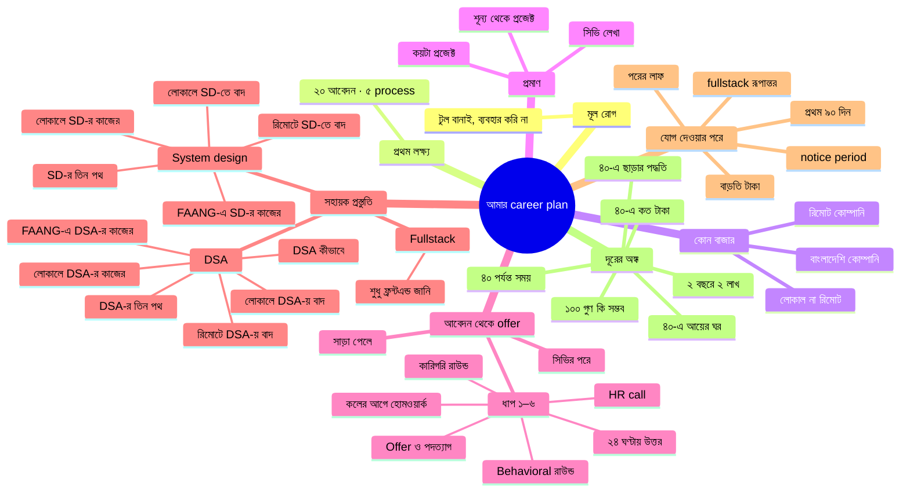

# Thought Map — আমার career plan

*শেষ স্ক্যান: **২০২৬-০৯-১৩** · **৩৯টা ফাইল** · নিয়ম → [AGENTS.md](AGENTS.md)*

সব ফাইল মিলে একটাই পরিকল্পনা। মানচিত্রটা দেখায় কোন ফাইল কোন ধারণার অংশ; নিচের টেবিলগুলো দেখায় কোনটা কোনটার সাথে যুক্ত, আর কোথায় কী অমিল ছিল।

---

## Mindmap

---

## ফাইল-তালিকা

| # | লেবেল | ফাইল | শাখা |
|---|---|---|---|
| ১ | টুল বানাই, ব্যবহার করি না | [memory.md](memory.md) | মূল রোগ |
| ২ | ২০ আবেদন · ৫ process | [what-will-be-my-first-goal.md](what-will-be-my-first-goal.md) | প্রথম লক্ষ্য |
| ৩ | লোকাল না রিমোট | [what-should-i-target-local-or-remote.md](what-should-i-target-local-or-remote.md) | কোন বাজার |
| ৪ | বাংলাদেশি কোম্পানি | [crack-bangladeshi-company-roadmap.md](crack-bangladeshi-company-roadmap.md) | কোন বাজার |
| ৫ | রিমোট কোম্পানি | [crack-remote-company-roadmap.md](crack-remote-company-roadmap.md) | কোন বাজার |
| ৬ | কয়টা প্রজেক্ট | [how-many-projects-do-i-need.md](how-many-projects-do-i-need.md) | প্রমাণ |
| ৭ | শূন্য থেকে প্রজেক্ট | [how-many-projects-from-scratch.md](how-many-projects-from-scratch.md) | প্রমাণ |
| ৮ | সিভি লেখা | [how-to-write-my-cv.md](how-to-write-my-cv.md) | প্রমাণ |
| ৯ | সিভির পরে | [after-cv-approach.md](after-cv-approach.md) | আবেদন থেকে offer |
| ১০ | সাড়া পেলে | [after-getting-response.md](after-getting-response.md) | আবেদন থেকে offer |
| ১১ | ২৪ ঘণ্টায় উত্তর | [after-getting-response/01-reply-within-24h.md](after-getting-response/01-reply-within-24h.md) | আবেদন থেকে offer › ধাপ ১–৬ |
| ১২ | কলের আগে হোমওয়ার্ক | [after-getting-response/02-research-before-first-call.md](after-getting-response/02-research-before-first-call.md) | আবেদন থেকে offer › ধাপ ১–৬ |
| ১৩ | HR call | [after-getting-response/03-hr-recruiter-call.md](after-getting-response/03-hr-recruiter-call.md) | আবেদন থেকে offer › ধাপ ১–৬ |
| ১৪ | কারিগরি রাউন্ড | [after-getting-response/04-technical-rounds.md](after-getting-response/04-technical-rounds.md) | আবেদন থেকে offer › ধাপ ১–৬ |
| ১৫ | Behavioral রাউন্ড | [after-getting-response/05-behavioral-round.md](after-getting-response/05-behavioral-round.md) | আবেদন থেকে offer › ধাপ ১–৬ |
| ১৬ | Offer ও পদত্যাগ | [after-getting-response/06-offer-and-resign.md](after-getting-response/06-offer-and-resign.md) | আবেদন থেকে offer › ধাপ ১–৬ |
| ১৭ | DSA কীভাবে | [how-to-prepare-for-dsa.md](how-to-prepare-for-dsa.md) | সহায়ক প্রস্তুতি › DSA |
| ১৮ | DSA-র তিন পথ | [dsa-prep-how-many-paths.md](dsa-prep-how-many-paths.md) | সহায়ক প্রস্তুতি › DSA |
| ১৯ | লোকালে DSA-র কাজের | [dsa-prep-what-works-for-local.md](dsa-prep-what-works-for-local.md) | সহায়ক প্রস্তুতি › DSA |
| ২০ | FAANG-এ DSA-র কাজের | [dsa-prep-what-works-for-faang.md](dsa-prep-what-works-for-faang.md) | সহায়ক প্রস্তুতি › DSA |
| ২১ | লোকালে DSA-য় বাদ | [dsa-prep-what-to-ignore-for-local.md](dsa-prep-what-to-ignore-for-local.md) | সহায়ক প্রস্তুতি › DSA |
| ২২ | রিমোটে DSA-য় বাদ | [dsa-prep-what-to-ignore-for-remote.md](dsa-prep-what-to-ignore-for-remote.md) | সহায়ক প্রস্তুতি › DSA |
| ২৩ | SD-র তিন পথ | [system-design-how-many-paths.md](system-design-how-many-paths.md) | সহায়ক প্রস্তুতি › System design |
| ২৪ | লোকালে SD-র কাজের | [system-design-what-works-for-local.md](system-design-what-works-for-local.md) | সহায়ক প্রস্তুতি › System design |
| ২৫ | FAANG-এ SD-র কাজের | [system-design-what-works-for-faang.md](system-design-what-works-for-faang.md) | সহায়ক প্রস্তুতি › System design |
| ২৬ | লোকালে SD-তে বাদ | [system-design-what-to-ignore-for-local.md](system-design-what-to-ignore-for-local.md) | সহায়ক প্রস্তুতি › System design |
| ২৭ | রিমোটে SD-তে বাদ | [system-design-what-to-ignore-for-remote.md](system-design-what-to-ignore-for-remote.md) | সহায়ক প্রস্তুতি › System design |
| ২৮ | শুধু ফ্রন্টএন্ড জানি | [want-fullstack-but-only-know-frontend.md](want-fullstack-but-only-know-frontend.md) | সহায়ক প্রস্তুতি › Fullstack |
| ২৯ | notice period | [after-joining/07-notice-period.md](after-joining/07-notice-period.md) | যোগ দেওয়ার পরে |
| ৩০ | প্রথম ৯০ দিন | [after-joining/08-first-90-days.md](after-joining/08-first-90-days.md) | যোগ দেওয়ার পরে |
| ৩১ | বাড়তি টাকা | [after-joining/09-money-after-raise.md](after-joining/09-money-after-raise.md) | যোগ দেওয়ার পরে |
| ৩২ | fullstack রূপান্তর | [after-joining/10-fullstack-conversion.md](after-joining/10-fullstack-conversion.md) | যোগ দেওয়ার পরে |
| ৩৩ | পরের লাফ | [after-joining/11-next-jump.md](after-joining/11-next-jump.md) | যোগ দেওয়ার পরে |
| ৩৪ | ২ বছরে ২ লাখ | [two-lakh-per-month-in-2-years.md](two-lakh-per-month-in-2-years.md) | দূরের অঙ্ক |
| ৩৫ | ৪০ পর্যন্ত সময় | [how-many-things-by-age-40.md](how-many-things-by-age-40.md) | দূরের অঙ্ক |
| ৩৬ | ৪০-এ ছাড়ার পদ্ধতি | [how-to-quit-job-at-40.md](how-to-quit-job-at-40.md) | দূরের অঙ্ক |
| ৩৭ | ৪০-এ কত টাকা | [how-much-money-do-i-need-at-40.md](how-much-money-do-i-need-at-40.md) | দূরের অঙ্ক |
| ৩৮ | ১০০ গুণ কি সম্ভব | [can-i-earn-100x-average.md](can-i-earn-100x-average.md) | দূরের অঙ্ক |
| ৩৯ | ৪০-এ আয়ের ঘর | [exact-income-range-at-40.md](exact-income-range-at-40.md) | দূরের অঙ্ক |

---

## যোগসূত্র — যে ধারণাগুলো শাখা পেরিয়ে যায়

| ধারণা | যে ফাইলগুলোয় আছে |
|---|---|
| **টুল বানানোর ফাঁদ** — `dsa_prep`-এ ৪৮ commit, LeetCode-এ ২ | [memory](memory.md) · [প্রথম লক্ষ্য](what-will-be-my-first-goal.md) · [লোকাল না রিমোট](what-should-i-target-local-or-remote.md) · [বাংলাদেশি কোম্পানি](crack-bangladeshi-company-roadmap.md) · [রিমোট কোম্পানি](crack-remote-company-roadmap.md) · [কয়টা প্রজেক্ট](how-many-projects-do-i-need.md) · [DSA কীভাবে](how-to-prepare-for-dsa.md) · [FAANG-এ DSA](dsa-prep-what-works-for-faang.md) · [৪০ পর্যন্ত সময়](how-many-things-by-age-40.md) · [১০০ গুণ](can-i-earn-100x-average.md) · [২ বছরে ২ লাখ](two-lakh-per-month-in-2-years.md) |
| **২ লাখের চাকরি, দুই বদলে** — ২০২৮-০৯ | [২ বছরে ২ লাখ](two-lakh-per-month-in-2-years.md) · [লোকাল না রিমোট](what-should-i-target-local-or-remote.md) · [রিমোট কোম্পানি](crack-remote-company-roadmap.md) · [বাংলাদেশি কোম্পানি](crack-bangladeshi-company-roadmap.md) · [পরের লাফ](after-joining/11-next-jump.md) · [fullstack রূপান্তর](after-joining/10-fullstack-conversion.md) · [DSA-র তিন পথ](dsa-prep-how-many-paths.md) · [memory](memory.md) |
| **মুখে ইংরেজি** — রোজ ১৫ মিনিট | [বাংলাদেশি কোম্পানি](crack-bangladeshi-company-roadmap.md) · [রিমোট কোম্পানি](crack-remote-company-roadmap.md) · [সিভির পরে](after-cv-approach.md) · [HR call](after-getting-response/03-hr-recruiter-call.md) · [কারিগরি রাউন্ড](after-getting-response/04-technical-rounds.md) · [রিমোটে DSA-য় বাদ](dsa-prep-what-to-ignore-for-remote.md) · [পরের লাফ](after-joining/11-next-jump.md) · [২ বছরে ২ লাখ](two-lakh-per-month-in-2-years.md) · [৪০-এ আয়ের ঘর](exact-income-range-at-40.md) |
| **ছয়টা STAR story** — ২০২৬-১০-১৩ | [প্রথম লক্ষ্য](what-will-be-my-first-goal.md) · [লোকাল না রিমোট](what-should-i-target-local-or-remote.md) · [বাংলাদেশি কোম্পানি](crack-bangladeshi-company-roadmap.md) · [সাড়া পেলে](after-getting-response.md) · [Behavioral রাউন্ড](after-getting-response/05-behavioral-round.md) · [notice period](after-joining/07-notice-period.md) · [প্রথম ৯০ দিন](after-joining/08-first-90-days.md) |
| **Portfolio-র "[Your Name]"** | [memory](memory.md) · [প্রথম লক্ষ্য](what-will-be-my-first-goal.md) · [লোকাল না রিমোট](what-should-i-target-local-or-remote.md) · [বাংলাদেশি কোম্পানি](crack-bangladeshi-company-roadmap.md) · [রিমোট কোম্পানি](crack-remote-company-roadmap.md) · [২ বছরে ২ লাখ](two-lakh-per-month-in-2-years.md) |
| **সঞ্চয় ও সোনা** — মাসে ৪০,০০০, insurance নয় | [প্রথম লক্ষ্য](what-will-be-my-first-goal.md) · [লোকাল না রিমোট](what-should-i-target-local-or-remote.md) · [Offer ও পদত্যাগ](after-getting-response/06-offer-and-resign.md) · [বাড়তি টাকা](after-joining/09-money-after-raise.md) · [৪০ পর্যন্ত সময়](how-many-things-by-age-40.md) · [৪০-এ ছাড়ার পদ্ধতি](how-to-quit-job-at-40.md) · [৪০-এ কত টাকা](how-much-money-do-i-need-at-40.md) · [৪০-এ আয়ের ঘর](exact-income-range-at-40.md) · [রিমোট কোম্পানি](crack-remote-company-roadmap.md) |
| **`leave_management`** — fullstack রূপান্তর, ২০২৮-এর শেষে | [শুধু ফ্রন্টএন্ড জানি](want-fullstack-but-only-know-frontend.md) · [কয়টা প্রজেক্ট](how-many-projects-do-i-need.md) · [fullstack রূপান্তর](after-joining/10-fullstack-conversion.md) · [লোকালে SD-র কাজের](system-design-what-works-for-local.md) · [লোকালে SD-তে বাদ](system-design-what-to-ignore-for-local.md) |
| **`legacy_and_wisdom`-এর ৯টা stage** | [বাংলাদেশি কোম্পানি](crack-bangladeshi-company-roadmap.md) (Stage 1 · Switch) · [রিমোট কোম্পানি](crack-remote-company-roadmap.md) ও [পরের লাফ](after-joining/11-next-jump.md) (Stage 2 · Remote) · [memory](memory.md) (১০ বছরের রোডম্যাপ) — সত্যের উৎস `legacy_and_wisdom/docs/ASSUMPTIONS.md` |

---

## অমিল

### খোলা

| বিষয় | অমিল |
|---|---|
| `switch_remote_company_in_6_month/` ও `switch_global_company_in_6_month/` বানানোর অনুরোধ (২০২৬-০৯-১৫) | `what-should-i-target-local-or-remote.md` ও `crack-remote-company-roadmap.md` বলে রিমোট এখন শুধু লোকালের ২০ আবেদনের ভেতরে সরাসরি আবেদন, আসল জোর প্রথম বদলের পরে (২০২৭-০৭ → ২০২৮-০৯); `dsa-prep-how-many-paths.md` বলে গ্লোবাল "রোডম্যাপের কোনো stage-এ নেই"। রিমোট/গ্লোবালের আলাদা লক্ষ্য-সংখ্যা কোথাও লেখা নেই। **আংশিক উত্তর ২০২৬-০৯-১৫:** তিনটা plan এখনই তৈরি থাকবে, একে অন্যের বিকল্প — যে যেটা target করবে সেটাই চালাবে, যেকোনো দিন শুরু। পাঠক = নিজে (ব্যক্তিগত তথ্যসহ)। গ্লোবাল = দেশে থেকে big tech-মানের (FAANG-এর interview bar) কোম্পানিতে রিমোট — relocation নয়। ⏳ বাকি: রিমোট/গ্লোবালের লক্ষ্য-সংখ্যা |

### মীমাংসিত — ২০২৬-০৯-১৪

| বিষয় | সিদ্ধান্ত |
|---|---|
| `dsa_prep` — "তিনটা পথের জন্য তিনটা আলাদা অ্যাপ লাগে না" ([DSA-র তিন পথ](dsa-prep-how-many-paths.md)), "উপেক্ষা মানে মুছে ফেলা নয়" ([লোকালে DSA-য় বাদ](dsa-prep-what-to-ignore-for-local.md)), "নতুন repo — dip-এর ছদ্মবেশ" (`switch_local_company_in_6_month/docs/00-rules.md`) বনাম ব্যবহারকারীর অনুরোধ | `dsa_prep` (ফোল্ডার + repo) অবসরে; তিন পথ তিনটা সাইট — `dsa_prep_local_company` (৩০টা, ৪০ দিন), `dsa_prep_remote_company` (৫০টা, ৪৯ দিন), `dsa_prep_global_company` (১১০টা, ১৩৩ দিন)। সংখ্যা, টপিক আর ক্রম brainstorming-এর হুবহু — নতুন লক্ষ্য নয়। ৬ মাসের plan-এর DSA ঘর এখন লোকাল সাইটের লিংক। brainstorming-এর `dsa_prep` উল্লেখগুলো ইতিহাস হিসেবে অক্ষত; pin আর portfolio-র গল্পে `dsa_prep`-এর জায়গায় `dsa_prep_local_company` (`how-many-projects-do-i-need.md` ও ৬ মাসের plan হালনাগাদ) |
| `switch_company_in_6_month/` — "markdown থাক, সাইট বানাবেন না" (৩ ফাইল) বনাম ব্যবহারকারীর সাইটের অনুরোধ | ফোল্ডার এখন `switch_local_company_in_6_month/`, ভেতরের git মোছা; ১৮০ দিনের plan (শুধু লোকাল) + সাইট — ২৪ মাসের plan-এর মাস ০০–০৬-এর দিন-স্তরের বিস্তার, নতুন সংখ্যা নয়। ৫টা ফাইলে নাম হালনাগাদ |

### মীমাংসিত — ২০২৬-০৯-১৩

| বিষয় | সিদ্ধান্ত |
|---|---|
| অভিজ্ঞতা ৩ নাকি ৪ বছর | চাকরি শুরু ২০২২-১১-০১ → ৪ বছর |
| বয়স ৩২ নাকি ৩৩ | জন্ম ১৯৯৩-০৭-০৩ → ৩৩ |
| লোকাল + চুক্তি, নাকি আগে লোকাল | দুই বদল: যেটা আগে আসে, তারপর ১২ মাস পরে রিমোট; পাশে চুক্তির কাজ নয় |
| DSA কয়টা | লোকাল ৩০ (workbook টপিক ১–৫) · রিমোট ~৫০ |
| আবেদন কবে শুরু | আজ থেকে — প্রথম আবেদন ২০২৬-০৯-২০-এর মধ্যে |
| Fullstack প্রজেক্ট কবে | ২০২৮-এর শেষে; চাকরি খোঁজায় pin ৩টা frontend |
| রিমোট ট্র্যাক | এখন সরাসরি আবেদন; blog/ভেটিং প্রথম বদলের পরে |
| সপ্তাহে কত ঘণ্টা | ৭ ঘণ্টা |
| Insurance | নিজে কিনবেন না, অফিস দিলে নেবেন; সঞ্চয় → সোনা |
| মাসিক সঞ্চয় ও খরচ | সঞ্চয় ৪০,০০০ · খরচ ১৫,০০০ (সব মিলিয়ে) · ৬ মাসের emergency fund আছে |
| বেতন বাড়ার পরে সঞ্চয় | প্রথম ৬ মাস ৪০,০০০ + বাড়তির পুরোটা, তারপর + অর্ধেক |
| আবেদনের spreadsheet | ৬ কলাম |
| Google L5 | লক্ষ্য নয়, দিক — কোনো stage-এ নেই |
| STAR story কবে | প্রথমটা এই সপ্তাহে, ৬টা ২০২৬-১০-১৩-এর মধ্যে |
| "৪০-এ পেশা ছাড়ব" মানে | দুটোই — শুরু চাকরি ছাড়া দিয়ে, কাজ পুরো বন্ধ বিকল্প হিসেবে |
| চাকরি ও রোডম্যাপ কতদিন | চাকরি ৪০ পর্যন্ত · রোডম্যাপ ১০ বছর, বয়স ৩৩–৪৩, ৯টা stage |
| ছাড়ার দিনে সঞ্চয় | লক্ষ্য ২৪ মাস; ১৮-এর কম হলে নয় |
| ছাড়ার দিনে বাইরের আয় | খরচের ৫০% |
